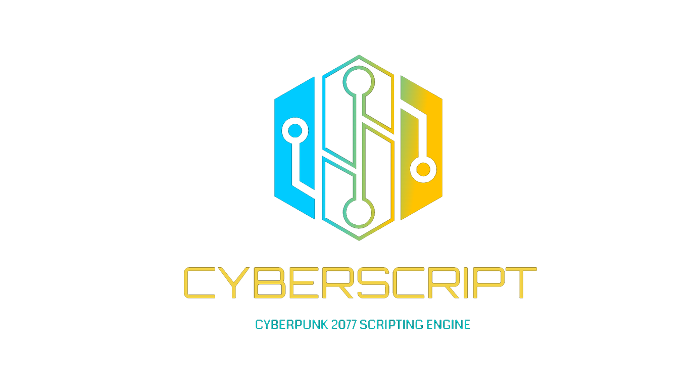

Scripting Engine for Cyberpunk 2077

This mod is under heavy development and reconstruction, so use at your own risk. We are not responsible for save corruption.

# What it is

**CyberScript**  is built based on CET, this mod is a powerful scripting engine for Cyberpunk 2077. It's an highly flexible scripting engine with triggers, action system, conditional statements, logic operations and function definitions to achieve endless possibilities. **Create your own night city with this mod**.

See the [Quick start](quickstart.md) guide for more details.

# Features

- In-game editor.
- Custom Quest, Dialog, Subtitle and Shards.
- Support for Phone Conversation, Circuit with Path, Faction, Event, Fixer, Housing, Place, NPC, Sounds, Texture and Radio.
- Organized collection of scripts called **mods**.
- No **hard-coded** quests.

# Wiki

Check out our [Wiki](https://cyberscript77.github.io/wiki/).

# Release notes

View the [Change log](changelog.md) to know the details of each versions.

# Support

- Join our [Discord server](https://discord.gg/4qQa3v7gGs) for bug reports, feature requests, or questions
- Visit our [Github](https://github.com/cyberscript77/release) for open source code.
- Add a ⭐️ [star on GitHub](https://github.com/cyberscript77/release) to support the plugin!

# License

This project is licensed under the terms of the [MIT](google.com) license.
 © [CyberScript](google.com)
