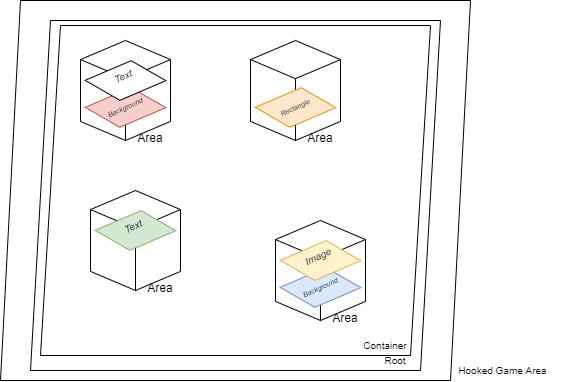
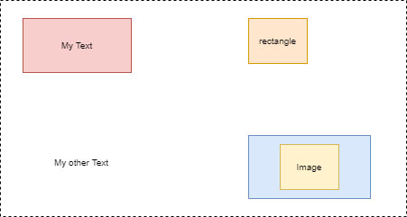

# Create custom interface

> In this page, you will be able to follow an small tutorials about making your own interface in JSON and play it with Cyberscript.

**It will be an long but fully complete tutorial. At the end you will be able to see the described interface (UI).**

**To start, you need:**
- 📄 Text editor : VS code, Notepad (hard but possible) or Notepad ++ (my favorite). Along with Notepad++ you need a Json Plugin for it as well.
- ✍️ Knowing fundamentals of JSON (read it, it's easy 😀 ) [here](https://www.w3schools.com/js/js_json_intro.asp)
- 💯 Read the fundamental about Cyberscript: [Scripting Basics](scripting-basics.md)
- ✔ an JSON validator website (for be sure that your json is not malformatted, because it will not compile if) [JSONlint](https://jsonlint.com/)
- 🧠 a Brain, that work not that bad :)
- 🥇 Cyberpunk Game with Cyberscript installed and working
- ⏲ Patience, you will discover a new thing. It require patience and trial and error before it works.

**Ok now I will assume you have it all. let's start !**<hr>

# 📁 Introduction

We assume here that you already [create an datapack folder](create-an-datapack-folder.md)
<br>We will create .... interface !

# 📱 Create a Interface

**📂 Setup the folder**

First : in your datapack folder, create a folder named "interfaces". It will contain every interfaces script of your datapack. Logic !

In this folder, create a JSON text file, like for example : myUI.json

Open it with your favorite text editor.

**💀 Write the interfaces skeleton**

Now we have a blank page. But don't worry, we will fill it step by step.

Let's talk about interface structure :

A dialog is an list of choice. a choice have several things :
- A Desc
- A speaker
- a Tag
- several triggers (what will unlock the choice) you can found the list here
- triggers requirement (in which order triggers need to be fulfilled to unlock the choice)
- an options list : some object that will perform when you choose it.

Now let's make it in JSON :

```json
{
	"title": "myUI",
	"tag": "myUI",
	"onload_action": [

  ...list of actions that will be performed when UI is loaded


	],
	"controls": 
  [
  ...list of the differents elements inside the UI
  ]
}
```

This is the skeleton of our interface. For resume what you see below : The interface is named "myUI",

Cyberscript know it as "myUI".

it have a empty on_load actions list.

it have a empty controls list.

Lets fill control list with 2 elements :

```json
{
	"title": "myUI",
	"tag": "myUI",
	"onload_action": [

 


	],
	"controls": 
	[
	  	{
			"type": "area",
			"tag": "rootarea",
			"rotation": 0,
			"anchor": 15,
			"fittocontent": true,

			"trigger": {
				"auto": {
					"name": "auto"
				}
			},
			"margin": {
				"left": 0,
				"top": 0
			},
			"size": {
				"width": 1000,
				"height": 1000
			},
			"scale": {
				"width": 1,
				"height": 1
			},
			"requirement": [
				[
					"auto"
				]
			]
		},


		{
			"type": "area",
			"tag": "container",
			"parent": "rootarea",
			"rotation": 0,
			"anchor": 15,
			"opacity": 1,
			"visible": true,
			"fittocontent": false,
			
			"trigger": {
				"auto": {
					"name": "auto"
				}
			},
			"margin": {
				"left": 0,
				"top": 0
			},
			"size": {
				"width": 1000,
				"height": 1000
			},
			"scale": {
				"width": 1,
				"height": 1
			},
			"requirement": [
				[
					"auto"
				]
			]
		},
  ]
}
```


Before getting into it, let's talk a little about UI process.

Your UI is an stack of layer that you put one over one.

Your base will be the lowest layer then you stack new element on it.

Cyberscript let you use interface in 3 ways possible for now : 

- Inside an popup windows like shard, the base will be the popup element hud, you don't need to take care of it.
- As HUD element, you will be able to stack on an particular hud element. It can be the whole HUD "frame", that is invisible or hook to an hud element like mini-map.
- As custom WebPage, the base will be the web browser page layout, who is invisible.

Why I told you this ? because depending the way you choose, you will apply your interface to different "bases".

For schema it : 

```structure


						
					   Text
					    |
Text				Image	   Area	
 |				  |         |
Button				Rectangle___		Text
 |				  |			  |
Background			Background		Circle
 |    				  |   			  |
Area				Area			Area
 |				  |             	  |          ....
___________________________________________________________________________________________________________________________________________________________
								 |
							    Your UI Base
								 |
							Hooked Game Base
						 (popup, exiiting hud element, webpage browser)
```


Now, back to work.


Here you have written two elements. They look like very similar but it's important to have theses one. It will be the personnal base of your UI.

let's look at the first one :


```json

{
			"type": "area",
			"tag": "rootarea",
			"rotation": 0,
			"anchor": 15,
			"fittocontent": true,

			"trigger": {
				"auto": {
					"name": "auto"
				}
			},
			"margin": {
				"left": 0,
				"top": 0
			},
			"size": {
				"width": 1000,
				"height": 1000
			},
			"scale": {
				"width": 1,
				"height": 1
			},
			"requirement": [
				[
					"auto"
				]
			]
		},


```


- "type":  There are several type for element, we will describe them later. We choose area, means its an area, simple.
- "tag": the identity of this element in Cyberscript
- "rotation": You can rotate this element to an angle (like 180° or 360°) ([Do your math](https://en.wikipedia.org/wiki/Angle))
- "anchor": This one is hard to describe and very important. It determine how is hooked your element to his parent. In that specific case, the parent is one of 3 possible way and is not mentionned. We use 15, means Fill. It will fill the whole area according to the parent size. 

Here the list of possible Anchors : 
```csharp

inkEAnchor
{
   TopLeft = 0,
   TopCenter = 1,
   TopRight = 2,
   CenterLeft = 3,
   Centered = 4,
   CenterRight = 5,
   BottomLeft = 6,
   BottomCenter = 7,
   BottomRight = 8,
   TopFillHorizontaly = 9,
   CenterFillHorizontaly = 10,
   BottomFillHorizontaly = 11,
   LeftFillVerticaly = 12,
   CenterFillVerticaly = 13,
   RightFillVerticaly = 14,
   Fill = 15
}


```


- "fittocontent": means your element size will fit to his content (elements hooked on it)
- "trigger": see [Scripting basics](https://cyberscript77.github.io/wiki/#/scripting-basics)
- "requirement":see [Scripting basics](https://cyberscript77.github.io/wiki/#/scripting-basics)
- "margin": From the anchor point, the margin of your element. It can be "top","bottom","left","right". For example you want that your element have an extra space from the top border of your container area, you will put "top":15, it will add 15 pixel margin from the top border of the parent.
- "size": the size of your element, "width" and "height"
- "scale": the scale of your element, "width" and "height". Leave it to 1 if not needed.


This element is the first layer over the game element. it's your entry point to hook and create UI. But in that form it's unusable. Thta's why we need the second element : 


```json

{
			"type": "area",
			"tag": "container",
			"parent": "rootarea",
			"rotation": 0,
			"anchor": 15,
			"opacity": 1,
			"visible": true,
			"fittocontent": false,
			
			"trigger": {
				"auto": {
					"name": "auto"
				}
			},
			"margin": {
				"left": 0,
				"top": 0
			},
			"size": {
				"width": 1000,
				"height": 1000
			},
			"scale": {
				"width": 1,
				"height": 1
			},
			"requirement": [
				[
					"auto"
				]
			]
		},


```

Now we have the second layer and think can really start to begin. 

You can see that it have an field "parent" who tag "rootarea". 

It means "from that parent "rootarea", stack an new area on it called "container" ".

It also have an field "visible", if you want hide or show an element.


Basically, you have to see theses two elements as an "ground" and you will put several box on this ground. In theses box, there is several elements.

Like this : 




If we look from upper the ground, it will result an UI, like the game will display it 




Now we will want to display an Text message, with color and background. Let's try !


##Make your first element !

At first, we need to add an smaller area that will contains our text.

let's add : 


```json
{
	"title": "myUI",
	"tag": "myUI",
	"onload_action": [

 


	],
	"controls": 
	[
	  	{
			"type": "area",
			"tag": "rootarea",
			"rotation": 0,
			"anchor": 15,
			"fittocontent": true,

			"trigger": {
				"auto": {
					"name": "auto"
				}
			},
			"margin": {
				"left": 0,
				"top": 0
			},
			"size": {
				"width": 1000,
				"height": 1000
			},
			"scale": {
				"width": 1,
				"height": 1
			},
			"requirement": [
				[
					"auto"
				]
			]
		},


		{
			"type": "area",
			"tag": "container",
			"parent": "rootarea",
			"rotation": 0,
			"anchor": 15,
			"opacity": 1,
			"visible": true,
			"fittocontent": false,
			
			"trigger": {
				"auto": {
					"name": "auto"
				}
			},
			"margin": {
				"left": 0,
				"top": 0
			},
			"size": {
				"width": 1000,
				"height": 1000
			},
			"scale": {
				"width": 1,
				"height": 1
			},
			"requirement": [
				[
					"auto"
				]
			]
		},
		{
			"type": "area",
			"tag": "title_area",
			"parent": "container",
			"rotation": 0,
			"anchor": 15,
			"opacity": 1,
			"fittocontent": false,
			"trigger": {
				"auto": {
					"name": "auto"
				}
			},
			"margin": {
				"left": 0,
				"top": 15
			},
			"size": {
				"width": 200,
				"height": 200
			},
			"scale": {
				"width": 1,
				"height": 1
			},
			"requirement": [
				[
					"auto"
				]
			]
		},
  ]
}
```
We add an area "title_area", that stack from "container". Width and height are 200, there is no particular trigger and requirement (auto) and scale is 1:1.
Opacity is 1 (means its totally visible). It doesn't fit to content who will be stacked in it. Anchor from parent is Fill(15). There is an top margin of 15 pixel from the top parent border according to the anchor.


Now we want add an rectangle who will be our backgound frame to that element.


```json
{
	"title": "myUI",
	"tag": "myUI",
	"onload_action": [

 


	],
	"controls": 
	[
	  	{
			"type": "area",
			"tag": "rootarea",
			"rotation": 0,
			"anchor": 15,
			"fittocontent": true,

			"trigger": {
				"auto": {
					"name": "auto"
				}
			},
			"margin": {
				"left": 0,
				"top": 0
			},
			"size": {
				"width": 1000,
				"height": 1000
			},
			"scale": {
				"width": 1,
				"height": 1
			},
			"requirement": [
				[
					"auto"
				]
			]
		},


		{
			"type": "area",
			"tag": "container",
			"parent": "rootarea",
			"rotation": 0,
			"anchor": 15,
			"opacity": 1,
			"visible": true,
			"fittocontent": false,
			
			"trigger": {
				"auto": {
					"name": "auto"
				}
			},
			"margin": {
				"left": 0,
				"top": 0
			},
			"size": {
				"width": 1000,
				"height": 1000
			},
			"scale": {
				"width": 1,
				"height": 1
			},
			"requirement": [
				[
					"auto"
				]
			]
		},
		{
			"type": "area",
			"tag": "title_area",
			"parent": "container",
			"rotation": 0,
			"anchor": 15,
			"opacity": 1,
			"fittocontent": false,
			"trigger": {
				"auto": {
					"name": "auto"
				}
			},
			"margin": {
				"left": 0,
				"top": 15
			},
			"size": {
				"width": 200,
				"height": 200
			},
			"scale": {
				"width": 1,
				"height": 1
			},
			"requirement": [
				[
					"auto"
				]
			]
		},
		{
			"type": "rectangle",
			"tag": "title_background",
			"fittocontent": false,
			"anchor": 0,
			"opacity": 0.2,
			"parent": "title_area",
			"trigger": {
				"auto": {
					"name": "auto"
				}
			},
			"margin": {
				"top": 0,
				"left": 0
			},
			"textcolor": {
				"red": 46,
				"blue": 209,
				"green": 209
			},
			"size": {
				"width": 200,
				"height": 100
			},
			"scale": {
				"width": 1,
				"height": 1
			},
			"requirement": [
				[
					"auto"
				]
			]
		},
  ]
}
```
Here, we have an reactangle typed element tagged as "title_background", hooked to "title_area". Width is 200 and height is 100, there is no particular trigger and requirement (auto) and scale is 1:1.
Opacity is 0.2. It doesn't fit to content who will be stacked in it. Anchor from parent is TopLeft (0). There is no speicific margin. The color of the element is 
"red": 46, "blue": 209 and "green": 209 who result as [this color](https://colorpicker.me/#2ed1d1) .


Now we will add an text on that box : 

```json
{
	"title": "myUI",
	"tag": "myUI",
	"onload_action": [

 


	],
	"controls": 
	[
	  	{
			"type": "area",
			"tag": "rootarea",
			"rotation": 0,
			"anchor": 15,
			"fittocontent": true,

			"trigger": {
				"auto": {
					"name": "auto"
				}
			},
			"margin": {
				"left": 0,
				"top": 0
			},
			"size": {
				"width": 1000,
				"height": 1000
			},
			"scale": {
				"width": 1,
				"height": 1
			},
			"requirement": [
				[
					"auto"
				]
			]
		},


		{
			"type": "area",
			"tag": "container",
			"parent": "rootarea",
			"rotation": 0,
			"anchor": 15,
			"opacity": 1,
			"visible": true,
			"fittocontent": false,
			
			"trigger": {
				"auto": {
					"name": "auto"
				}
			},
			"margin": {
				"left": 0,
				"top": 0
			},
			"size": {
				"width": 1000,
				"height": 1000
			},
			"scale": {
				"width": 1,
				"height": 1
			},
			"requirement": [
				[
					"auto"
				]
			]
		},
		{
			"type": "area",
			"tag": "title_area",
			"parent": "container",
			"rotation": 0,
			"anchor": 15,
			"opacity": 1,
			"fittocontent": false,
			"trigger": {
				"auto": {
					"name": "auto"
				}
			},
			"margin": {
				"left": 0,
				"top": 15
			},
			"size": {
				"width": 200,
				"height": 200
			},
			"scale": {
				"width": 1,
				"height": 1
			},
			"requirement": [
				[
					"auto"
				]
			]
		},
		{
			"type": "rectangle",
			"tag": "title_background",
			"fittocontent": false,
			"anchor": 0,
			"opacity": 0.2,
			"parent": "title_area",
			"trigger": {
				"auto": {
					"name": "auto"
				}
			},
			"margin": {
				"top": 0,
				"left": 0
			},
			"textcolor": {
				"red": 46,
				"blue": 209,
				"green": 209
			},
			"size": {
				"width": 200,
				"height": 100
			},
			"scale": {
				"width": 1,
				"height": 1
			},
			"requirement": [
				[
					"auto"
				]
			]
		},
		
		{
			"type": "label",
			"tag": "title_text",
			"rotation": 0,
			"anchor": 0,
			"fittocontent": false,
			"opacity": 1,
			"parent": "title_area",

			"trigger": {
				"auto": {
					"name": "auto"
				}
			},
			"margin": {
				"left": 0,
				"top": 75
			},
			"style": {
				"fontsize": 30
			},
			"textcolor": {
				"red": 255,
				"blue": 255,
				"green": 255
			},
			"size": {
				"width": 100,
				"height": 200
			},
			"scale": {
				"width": 1,
				"height": 1
			},
			"requirement": [
				[
					"auto"
				]
			],
			"text": "Hello Cyberworld ! :) "
		},
  ]
}
```
Here, we have an label typed element tagged as "title_text", hooked to "title_area". Width is 200 and height is 100, there is no particular trigger and requirement (auto) and scale is 1:1.
Opacity is 1. It doesn't fit to content who will be stacked in it. Anchor from parent is TopLeft (0). There is no top margin of 75. The color of the element is 
"red": 255, "blue": 255 and "green": 255 who result as [this color](https://colorpicker.me/#ffffff) . font-size is 30.


And it's done ! 

You make an custom UI with an label and background, easy no ?

## Dynamic content

But what if we can dynamically change some properties like the color or the text content of an element ?


for this you can add the field :

```json
"dynamic": [],
```


Inside that field, you can add one or several type of dynamic refreshing props. Here is the list : 
-"default" will update the props : "textcolor","visible","opacity","rotation","size","margin","translation","padding","pivot","text"
-For an label typed element, "text" will  refresh the text props.
-For an shape typed element, "shape" will refresh the props "vertex","shapevariant","linethickness","endcapstyle"

For any other elements that are not typed as button or scrollarea : 
-"color" will refresh textcolor props
-"visible" will refresh visible props
-"opacity" will refresh opacity props
-"rotation" will refresh rotation props
-"size" will refresh width and height props
-"margin" will refresh textcolor props
-"translation" will translationwidth and translationheight props
-"padding" will refresh padding props
-"pivot" will refresh transformwidth and transformheight props


Combine it with context on element and you will have an dynamic element that will be refresh every frame !

so for example : 
```json
"dynamic": ["color","text],
```


will refresh after an context checking the props textcolor and text of an label element.


## Global Propeties for all elements 
- type : type of the element
- tag : tag of the element
- parent : parent of the element
- margin 
```json
"margin": {
	"left": 1050,
	"top": 250
},
```
- padding
```json
"padding": {
	"left": 1050,
	"top": 250
},
```
- size
```json
"size": {
	"width": 1050,
	"height": 250
},
```
- scale
```json
"scale": {
	"width": 1050,
	"height": 250
},
```
- translation
```json
"translation": {
	"width": 1050,
	"height": 250
},
```
- transform
```json
"transform": {
	"width": 1050,
	"height": 250
},
```
- textcolor
```json
"textcolor": {
	"red": 30,
	"blue": 205,
	"green": 155
},
```
- fittocontent
 ```json
"fittocontent": true,
```
- opacity
```json
"opacity": 1,
```
- rotation
```json
"rotation": 45,
```
- interactive
```json
"interactive": true,
```
- event
```json
"event": [
	{
		"eventname": "OnEnter", ... can be "OnEnter","OnRelease","OnLeave"
		"action:[
		..action list
		],
	
	
	}
],
```
- horizontalalign 
```json
"horizontalalign": 0, ...   Fill = 0,   Left = 1,   Center = 2,   Right = 3
```
- anchor
```json
"anchor": 0 ...TopLeft = 0,   TopCenter = 1,   TopRight = 2,   CenterLeft = 3,   Centered = 4,   CenterRight = 5,   BottomLeft = 6,   BottomCenter = 7,   BottomRight = 8,   TopFillHorizontaly = 9,   CenterFillHorizontaly = 10,   BottomFillHorizontaly = 11,   LeftFillVerticaly = 12,   CenterFillVerticaly = 13,   RightFillVerticaly = 14,   Fill = 15
},
```
- verticalalign
```json
"verticalalign": 0,  ... Fill = 0,   Top = 1,   Center = 2,   Bottom = 3
```
- style
```json
"style": {
	"fontsize": 30
},
```

## Type of elements 


### ◻ - Label ("label")
Simple text. 

Special properties :
- "text" : text content
- "split": XX (optionnal, XX is number) : will split the text into X characters sections
- style
```json
"style": {
	"fontsize": 30
},
```
-scrollspeed : 5 => enable scrolling text animation
-scrolldelay : 5 =>  delay between each scrolling animation
-autoscroll : true/false => enable auto scrolling animation


### ◻ - Text Input ("textinput")
Simple text input. 

Special properties :
- "text" : text content
- "split": XX (optionnal, XX is number) : will split the text into X characters sections
- style
```json
"style": {
	"fontsize": 30
},
```
-scrollspeed : 5 => enable scrolling text animation
-scrolldelay : 5 =>  delay between each scrolling animation
-autoscroll : true/false => enable auto scrolling animation


### ◻ - Image ("image")
Simple image from game resources. 

Special properties :
-"tweak": "base\\gameplay\\gui\\quests\\assets\\q001_sandra.inkatlas" => take the image library 
-"texture": "Trauma_Text" => take the image part in the library

### Button ("button")
Button widget.

Special properties :
-"bgcolor": will be the background color
```json
"bgcolor": {
	"red": 30,
	"blue": 205,
	"green": 155
},
```
!!! textcolor will be the button text color !!!
-"action" : list of action when clicked on the button
-"onenter_action" : list of action when hover on the button
-"onleave_action" : list of action when hover off the button

-"texture": "Trauma_Text" => take the image part in the library


### ◻ - Scroll Area ("scrollarea")
An scrollable Area. 


### ◻ - Area ("area")
An Area. Simple and efficient 

### ◻ - Vertical Area ("vertical_area")
Will display children in vertical line.
Special properties :
- childmargin : margin of the child inside the area
```json
"childmargin": {
	"left": 1050,
	"top": 250
},
```

### ◻ - Horinzontal Area ("horizontal_area")
Will display children in horinzontal line.
Special properties :
- childmargin : margin of the child inside the area
```json
"childmargin": {
	"left": 1050,
	"top": 250
},
```

### ◻ - Rectangle ("rectangle")
An simple Rectangle

### ◻ - Circle ("circle")
An simple Circle.

### ◻ - Custom Shape ("shape")
An custom shape.
Special properties :
- shapevariant : how will be filled the shape
```json
"shapevariant": 0 ... Fill = 0,   Border = 1,   FillAndBorder = 2
```
- linethickness : line thickness 
```json
"linethickness": 5
```
- endcapstyle : End Cap Style
```json
"endcapstyle": 3 ... BUTT = 0,   SQUARE = 1,   ROUND = 2,   JOINED = 3
```
- vertex : Points of the shape
```json
"vertex": [
	{
		"x": 0,
		"y": 0
	},
	{
		"x": 1400,
		"y": 0
	},
	{
		"x": 1400,
		"y": 1000
	},
	{
		"x": 0,
		"y": 1000
	}
],
```


# Make an interact that will call your dialog !

UI are called through an action.

so we need make an interact to show it.

you can follow this tutorial to make an interact : [How to make an custom Interact ?](create-custom-interact.md)

There is a small example that will work :

```json
{
	"name": "Test My Amazing UI",
	"tag": "myamazinguitest",
	"display": "event_interact",
	"type": "interact",
	"sorttag": "none",
	"trigger": {
		"mytrigger":{
		"name": "auto"
	    }
	},
	"requirement": [
		[
		"mytrigger"
		]
	],
	"action": [
	{
        "name":"apply_interface_to_hud",
       	"tag": "myUI",
	"parent":"main_root_default"
    }]
}
```
For hide it , you can make another interact :

```json
{
	"name": "Hide My Amazing UI",
	"tag": "myamazinguihide",
	"display": "event_interact",
	"type": "interact",
	"sorttag": "none",
	"trigger": {
		"mytrigger":{
		"name": "auto"
	    }
	},
	"requirement": [
		[
		"mytrigger"
		]
	],
	"action": [
	{
        "name":"clear_interface",
       	"tag": "myUI"
    }]
}
```

# Actions related to interfaces :
- open_interface : will open interface into an popup
- apply_interface_to_hud : will show interface on the hud
- clear_interface : will hide interface


# Test your interact and your dialog !

Copy your whole datapack folder in (GOG or steam game folder)/Cyberpunk 2077/bin/x64/plugins/cyber_engine_tweaks/mods/quest_mod/json/datapack/

so it should be in our case (GOG or steam game folder)/Cyberpunk 2077/bin/x64/plugins/cyber_engine_tweaks/mods/quest_mod/json/datapack/myAmazingDatapack

the structure of the folder should be

```structure
📂myAmazingDatapack
├── 📃 desc.json
├── 📁 interface
|    └── 📃 myUI.json
└── 📁 interact
    └── 📃 myamazinguitest.json
    └── 📃 myamazinguihide.json
```

Select the datapack "myAmazingDatapack" in cycle interact ([What are you talking about ?](cet-key-binding.md))

then hit the key for use your interact. Dialog should show !

<h2>Enjoy ! 🤠</h2><hr>

# 🔥 Want more ?
- [Creating Content with Cyberscript](creating-content-with-cyberscript.md)
