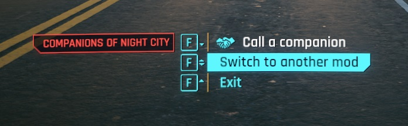

# Cycle throught Interact

Since we can't display so much interact in same time, you need to select which one you want use from the mod that contains it.

Depending on if you play with a controller or keyboard, you need to keybind some key in order to switch between using keyboard or controller.

First one, Cycle Custom Intereact is very important, to bind it, open CET windows and go to binding:

On gamepad, you can use it with left *D-Pad*

This key will allow you to go through current selected Mods's interacts if the Mods has any within it's folder.

Use the interact "Select active Interactions Group" to open the menu and select the current active Mods

then use Cycle Custom Interact key to choose the interact you want to use. 

