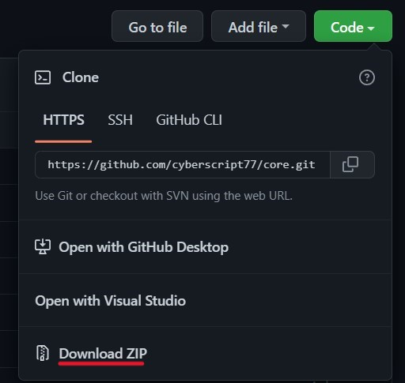

# Download from Github

> How to download from Github repository in any operating system.

# Github

If you are new to developing field, you may heard around a word called **Github (Version control)**, to be exact **Github** is an website or service where I can send my project and it will keep it for me and when I need it back, I can retrieve from their service.

This is some basic usage, but it has collaboration, project management and tons of features. You may need it if you are going to become a developer.

# FAQs

Common Questions before continuing:

- Do I need to download any apps to download your mod ? **No**
- Is downloading through github is safe ? **Yes**
- Do I have to pay to download ? **Never**
- Have I need to create an account to download ? **Nope, you can download anonymously**

# Download

Okay, so despite all these documentations, it's really easy than you think 😅

- Open the link we gave you (found on [Quick start](quickstart.md))
- After opening the link, click on the green **Code** button 
  

- It will open a dropdown menu like this 👇 
  

- Click on the `Download ZIP` button, and the file will be downloaded.
  
