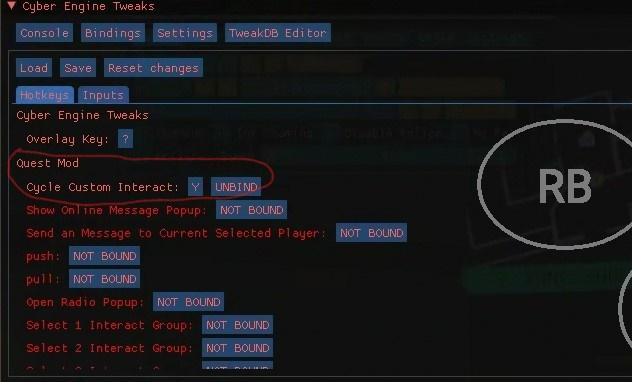
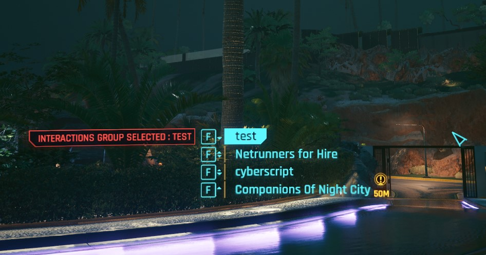

# Playing with cyberscript

> Should I say "How to use datapacks ?" Nvm..

!> Missions of Night City (`BROKEN TILL NOTICE`, but you can check example with Dirty Missions datapack, it's the same behavior 😉)

When enabling any datapack, whether it be in bunches or one at a time, ALWAYS GO TO CyberScript settings to `REFRESH DATAPACK CACHE`.

# Missions of Night City

- Download Mission of Night City datapack before and enable it.

- Go to any Fixer (look in map to find them) and open your missions journal.

- Missions journel will look like the below image

- Missions will be in "Available Quests" at the bottom.

?> If you have any problem in installation look into [Troubleshooting](troubleshooting.md) or post it on Discord.