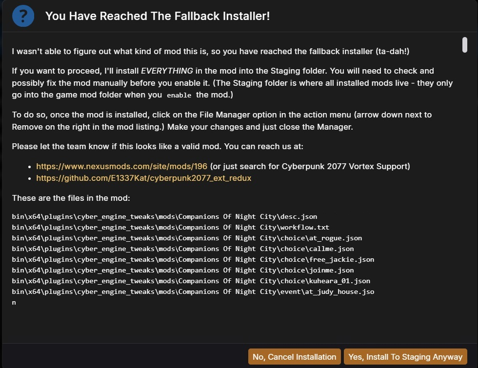
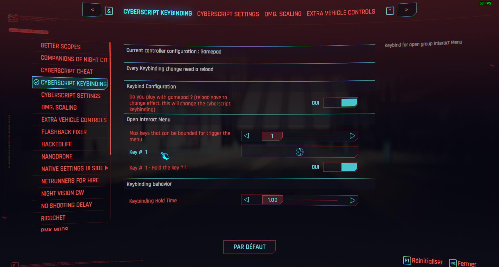
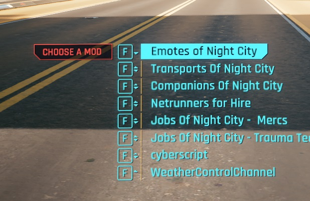

# Quick start

> This page covers the installation on windows, linux and steam deck.

⚠️ We support Vortex mod manager.

## 0 - Requirements

- [Native settings mod](https://www.nexusmods.com/cyberpunk2077/mods/3518).
- [Cyber Engine tweaks (CET)](https://www.nexusmods.com/cyberpunk2077/mods/107).
- [Codeware](https://www.nexusmods.com/cyberpunk2077/mods/7780).
- [CyberScript Core Animation Archive](https://www.nexusmods.com/cyberpunk2077/mods/7691).
- [Audioware](https://www.nexusmods.com/cyberpunk2077/mods/12001).

?> **Read their guide to install the requirements** and make sure you have the latest or updated version of these requirements.

## 1 - Download

To experience the mod, you have to download it first 🤩. Fortunately downloading CyberScript is common for all operating systems (i.e Windows, Linux, Steam Deck). But since, I have windows in my hand, I will demostrate using windows 🎀

There are two ways to download.

- Through Nexus platform
- Our Github repository

?> **Download from any one of the link**  ▶️ Link to download from our Nexus page https://www.nexusmods.com/cyberpunk2077/mods/6475 ▶️ Link to download from our github repository https://github.com/cyberscript77/release 🥺 Don't know how to download from github ? [Follow this guide](download-from-github.md)

After downloading our **CyberScript Core**, time to experience it 😋. Choose your operating system and follow the guide.

## 2 - Installation

?> Right now, CyberScript can be installed in three operating systems, **Windows 10 or 11**, **Linux or Steam Deck.** Follow the guides carefully to avoid rewriting some other files.   **Starting the Installation assuming, you have already downloaded the mod file.**

I'm using  : 

> How to install CyberScript on Windows 10, 11. 

- Open the [Downloaded ZIP from here](https://www.nexusmods.com/Core/Libs/Common/Widgets/DownloadPopUp?id=52734&game_id=3333)) using any software you like (ex. [7Zip](https://www.7-zip.org/), [WinRAR](https://www.win-rar.com/))
- It contains a folder called `bin`.
- Copy or Extract the `bin` folder to your Cyberpunk 2077 game installed folder.

### Linux and Steam Deck

In order to install our mod in Linux or Steam Deck, follow this [guide](installation-linux.md)

## 3 - Playing with CyberScript
You can get any mods that using cyberscript by looking in *requirements* -> *mods requiring this
file*
section on the Nexus webpage.
CyberScript alone will do nothing since it's a framework !

Mods powered by Cyberscript can only work in cyberscript framework.

### First use : 
#### Define a type of controller (keyboard or gamepad)
  1-  Pause Menu  
  2 - Go to "Mods"   
  3 - Go to "Cyberscript Keybinding"   
  4 - Check or not the toggle about controller : 

?> To help you understand how it works: 
Cyberscript has two types of keybinding configurations: one for the keyboard and one for the controller. 

This means that for each keybind, you can have two different configurations. The toggle allows you to switch between these configurations. For each configuration, you need to define the keybindings. 

Example: 
You define key "A" for the keyboard configuration. If you want to switch to a gamepad, toggle the setting, reload the save, and then assign "DPAD UP" for the controller configuration. (if you didn't do it already) 

You can check which configuration is loaded in each Cyberscript based mods settings : 

## 4 - Enable a Mod that require Cyberscript

?> This method is for Cyberscript Core 4.0 and more

Install them throught Vortex or manually, like any other mods.

?> Sometimes Vortex will display this :       It's because Audioware mods are not recognized by the CP2077 Vortex extension yet.   In this case, click on Yes, Intall to Staging Anyway

You can find settings for each mods by doing :   
1-  Pause Menu  
2 - Go to "Mods"   

## 5 - Open Interact Menu

Since we can't display so much interact in same time, you need to select which one you want use from the mod that contains it.

Depending on if you play with a controller or keyboard, you need to keybind some key in order to switch between using keyboard or controller.

First one,  you need to bind it.
How to do : 
1-  Pause Menu  
2 - Go to "Mods"   
3 - Go to "Cyberscript Keybinding"   
4 - Define the Keys in **Open Interact Menu** section 

This key will allow you to go through current selected Mods's interacts if the Mods has any within it's folder.

Now, in game, trigger the menu by pressing the key(s) you define just before.

It opens the current the currently active mod interactions group.

Use the interact "Switch to another mod" to change the currently active mod interactions group.

?> If you have any problem in installation, post it on Discord.

